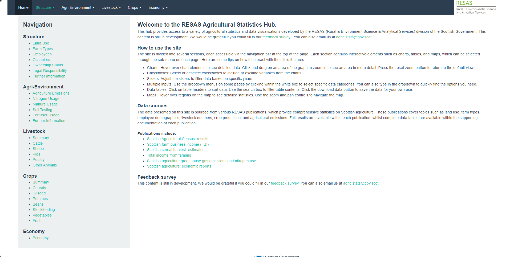
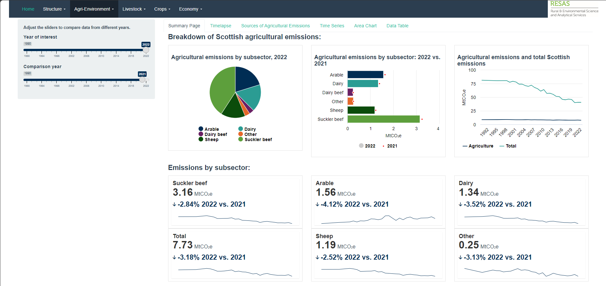
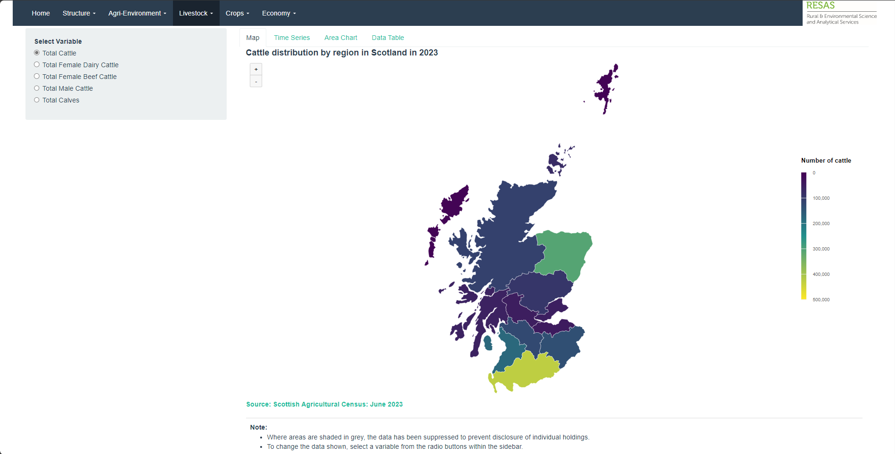

# RESAS Agricultural Statistics Hub Code

The RESAS Agricultural Statistics Hub is currently under development by the Rural & Environment Science & Analytical Services (RESAS) division of the Scottish Government. This hub provides access to a wide range of agricultural statistics and data visualisations, covering topics such as agricultural structure, agri-environment, livestock, and crop production in Scotland.

### Features

-   **Interactive Charts and Graphs**: Users can explore agricultural data through dynamic charts, maps, and tables. The interface allows for filtering, zooming, and detailed examination of specific datasets.

-   **Comprehensive Data**: The hub consolidates data from various publications, including the Scottish Agricultural Census, Scottish greenhouse gas emissions publication, and Farm Business Survey.

  
